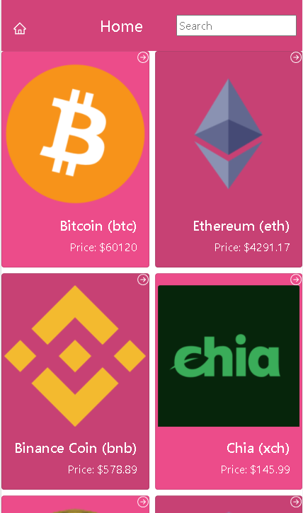
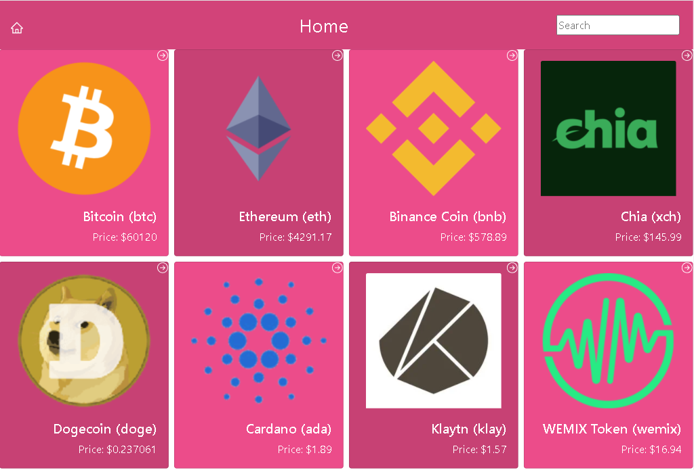

 [](https://hits.seeyoufarm.com)

# Crypto currency data (React Capstone Project)

Web application focused on mobile experience to show detailed information of popular crypto currencies.

## Preview

Mobile (425px)



Desktop (1024px)



## Built With

- Node.js
- React & Redux
- JavaScript
- Bootstrap

## Live Demo
[Heroku Live Demo](https://react-capstone-lfmn.herokuapp.com/)

## Getting Started

This project was bootstrapped with [Create React App](https://github.com/facebook/create-react-app).

- Run git clone on this project at the desired directory:
   ```
   git clone https://github.com/lfmnovaes/react-capstone.git
   ```
- Run `npm install` to install the necessary packages to run locally
- After installing everything, run `npm start` and your default browser will open with the page


## Other supported commands

<details>
  <summary>
    <b id="other">Click for details</b>
  </summary>

In the project directory, you can run:

### `npm start`

Runs the app in the development mode.\
Open [http://localhost:3000](http://localhost:3000) to view it in the browser.

The page will reload if you make edits.\
You will also see any lint errors in the console.

### `npm test`

Launches the test runner in the interactive watch mode.\
See the section about [running tests](https://facebook.github.io/create-react-app/docs/running-tests) for more information.

### `npm run build`

Builds the app for production to the `build` folder.\
It correctly bundles React in production mode and optimizes the build for the best performance.

The build is minified and the filenames include the hashes.\
Your app is ready to be deployed!

See the section about [deployment](https://facebook.github.io/create-react-app/docs/deployment) for more information.

</details>

## Authors

👤 **Luís Fernando**

- GitHub: [](https://github.com/lfmnovaes)
- Twitter: [](https://www.twitter.com/lfmnovaes/)
- LinkedIn: [](https://www.linkedin.com/in/lfmnovaes/)

## Credits

- [CoinGecko](https://www.coingecko.com/en/api/documentation) API
- [Nelson Sakwa](https://www.behance.net/sakwadesignstudio) for the [design](https://www.behance.net/gallery/31579789/Ballhead-App-(Free-PSDs)) inspiration

## 🤝 Contributing

Contributions, issues, and feature requests are welcome!

Feel free to check the [issues page](https://github.com/lfmnovaes/rockets-missions/issues).

## Show your support

Give a ⭐️ if you like this project!

## 📝 License

This project is [MIT](./LICENSE) licensed.
